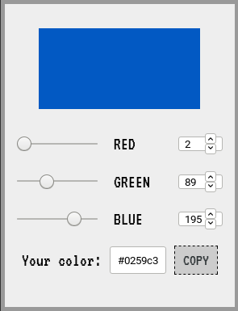

# Color picker 

That's a simple RGB color picker. It's so simple because it let me learn the basics of Vue.js and Webpack utilities

## Functions:
* selecting custom R, G, B components by both range and number inputs
* copying the output color to the clipboard
* simpliest design ever
* selecting random color at start
* simple input validation

## Design overview:

## Link:

https://bordowyrydwan.github.io/vue-color-picker/
